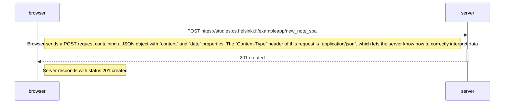

```mermaid
sequenceDiagram
    participant browser
    participant server

    browser->>server: POST https://studies.cs.helsinki.fi/exampleapp/new_note_spa

    Note right of browser: Browser sends a POST request containing a JSON object with `content` and `date` properties. The `Content-Type` header of this request is `application/json`, which lets the server know how to correctly interpret data

    activate server
    server-->>browser: 201 created
    deactivate server

    Note right of browser: Server responds with status 201 created
```
